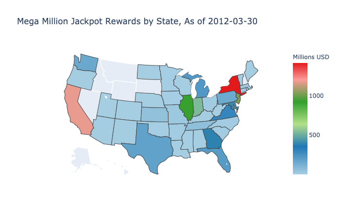
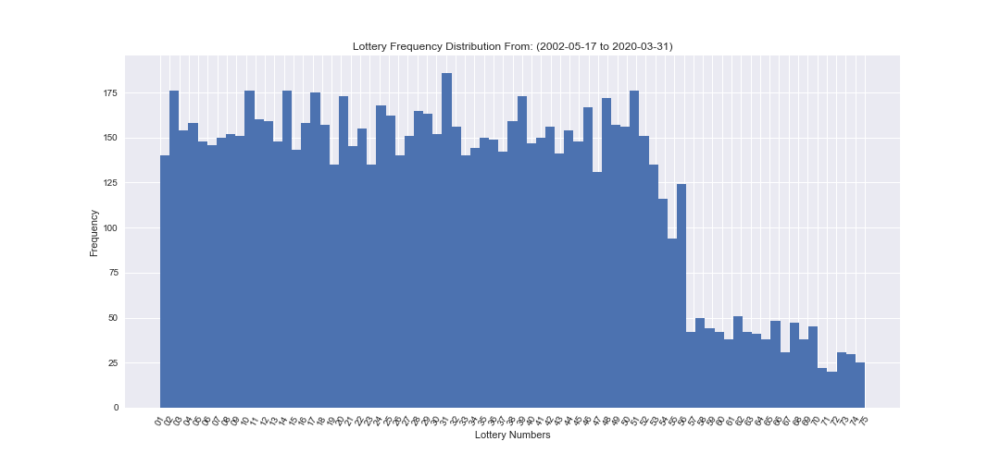
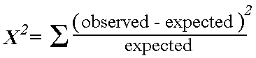
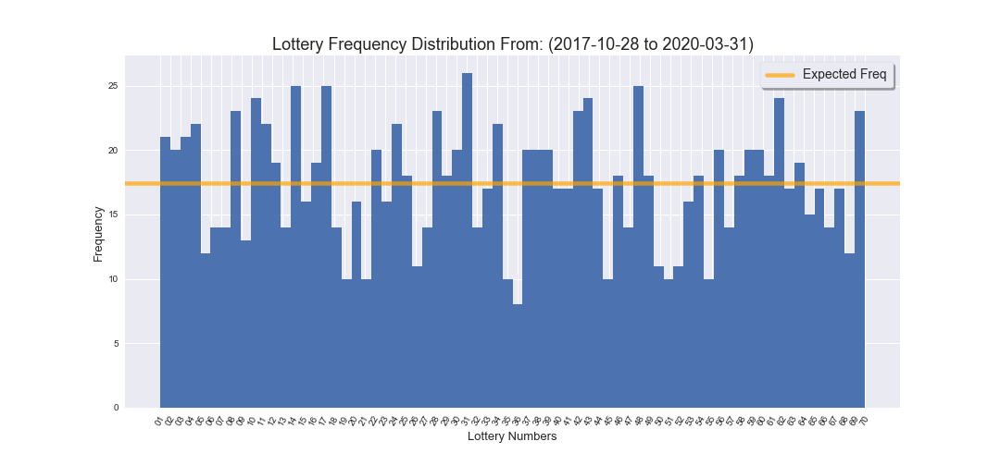

# Mega Millions May The Megaodds Be Ever In Your Favor
<p align="center" size=20%>
  
</p>
<p align="center">
  
</p>

## Table of Contents
* [General Information](#general-information)
    * [Data Gathering](#data-gathering)
    * [Data Information](#data-information)
    * [Hypothesis Testing](#hypothesis-testing)
* [Technologies](#technologies)
    * [Database](#database)
    * [Python](#python)
    * [Visualization](#visualization)
* [Future Improvements](#future-improvements)

## General Information
Mega Millions is one of the most popular national lotteries in the US, along side with Powerball.  Like most lotteries it comes with very basic rules.  Tickets cost $2.00 per play. Players pick six numbers from two separate pools of numbers - five different numbers from 1 to 70 (the white balls) and one number from 1 to 25 (the gold Mega Ball).  The odds of winning are 1 in 302,575,350.  So not really in anyones favor. However, beyond just taking odds at face value, I took a closer look at this lottery and put the numbers to the test. Chi-square Goodness-of-Fit Test to be precise.  My analysis and code can be found under the ```notebooks``` folder. 

<p align="center">
  
</p>


### Data Gathering:
Data used for this analysis was gathered from mega millions website https://www.megamillions.com/.  The data was loaded from a ```csv``` file, the results of the webscraping, from ```data``` directory.

### Data Information:
The data consists of 1,854 drawings since May 17, 2002 to March 31, 2020.  The hypothesis testing was done on a subset of that data due to changes in the Mega Millions lotto numbers, as noted on the table below.  The information about the winners and amounts was scraped directly from the mega millions website. 
<TABLE>
   <TR>    
       <TH>Starting Date</TH>
       <TH>Pick 5 White Balls From Field of</TH>
       <TH>Pick 1 Gold (Mega) Ball From Field of</TH>
       <TH>Jackpot odds</TH>
   </TR>
   <TR>
      <TD>September 6, 1996</TD>
      <TD>50</TD>
      <TD>25</TD>
      <TD>1: 52,969,000</TD>
   </TR>
   <TR>
      <TD>January 13, 1999</TD>
      <TD>50</TD>
      <TD>36</TD>
      <TD>1: 76,275,360</TD>
   </TR>
   <TR>
      <TD>May 15, 2002</TD>
      <TD>52</TD>
      <TD>52</TD>
      <TD>1: 135,145,920</TD>
   </TR>
   <TR>
      <TD>June 22, 2005</TD>
      <TD>56</TD>
      <TD>46</TD>
      <TD>1: 175,711,536</TD>
   </TR>
   <TR>
      <TD>October 19, 2013</TD>
      <TD>75</TD>
      <TD>15</TD>
      <TD>1: 258,890,850</TD>
   </TR>
   <TR>
      <TD>October 28, 2017</TD>
      <TD>70</TD>
      <TD>25</TD>
      <TD>1: 302,575,350</TD>
   </TR>
</TABLE>

### Hypothesis Testing:

###### Step 1: Set up the hypothesis
The null hypothesis is that the numbers occur with equal frequencies, they fit a uniform distribution.

Alternative hypothesis is that the numbers occur with unequal frequencies, they do not fit a uniform distribution.

>**H0: fit a uniform distribution**

>**H1: do not fit a uniform distribution**

###### Step 2: Select test statistic
To test this hypothesis the Chi-square Goodness-of-Fit Test was chosen.
The significance level was set at: 0.05

This test is used to determine whether sample data are consistent with a hypothesized distribution.

The data meets the following conditions:<br>
1) The sampling method is simple random sampling.<br>
2) The variable under study is categorical. Though we are dealing with numbers they a 3 does not mean is worth less then a 70.<br>  
3) The expected value of the number of sample observations in each level of the variable is at least 5.

###### Step 3: Set up decision rule
Reject the null hypothesis if test-statistic greater than our critical value of 89.391. Or our p-value is less than our alpha of 0.05

###### Step 4: Compute the test statistic
<p align="center">
  
</p>

###### Step 5: Conclusion
Given that the test statistic rendered 81.54 which is to the left (lower) of the critical value from the Chi-Square table of 89.391 and the p-value was greater than 0.05, There is not sufficient evidence to conclude that the lottery drawings numbers do not occur with equal frequencies.
<p align="center">
  
</p>

## Technologies
<p align="center">
  
</p>

###### Python:
Data Gathering: Beautiful Soup<br>
Data Analysis: Python 3, Numpy, Pandas, Scikit-Learn, Scipy<br>

###### Visualization:
Data Visualization: Matplotlib, Seaborn

## Future Improvements
• Enrich the dataset by continuing to update drawing numbers<br>
• Compare results to other nation/international lotteries<br>
• Improve code by making an analysis class to automate transformations<br>